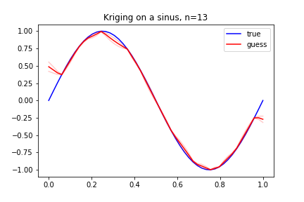

# Kriging Using Partial Least Squares: From Non-Bayesian To Bayesian

This work takes the article 1 as a reference paper and aims at transforming the frequentist treatment of the problems encountered in a Bayesian one. This project was done with Samuel Gruffaz for the MVA course "Bayesian Machine Learning" (2020), taught by Rémi Bardenet and Julyan Arbel. 

Kriging models (or Gaussian processes) are a powerful tool which aims at approximating a black-box function, for which evaluations are computationally costly. A good Kriging model relies on hyper-parameters tuning, usually done in a frequentist way by maximizing MLEs (Maximum Likelihood Estimators). In this work, Bayesian estimators are explored and compared to the frequentist's ones. 

The Partial Least Squares (PLS) method consists in reducing the dimension of the search space for the hyper-parameters. In this work, a Bayesian adaptation of PLS is discussed.

Execute the main.py file to see the results. Enjoy!

Reference : Mohamed-Amine Bouhlel, Nathalie Bartoli, Abdelkader Otsmane, Joseph Morlier. Improving kriging surrogates of high-dimensional design models by Partial Least Squares dimension reduction. 2015.  hal-01232938 

